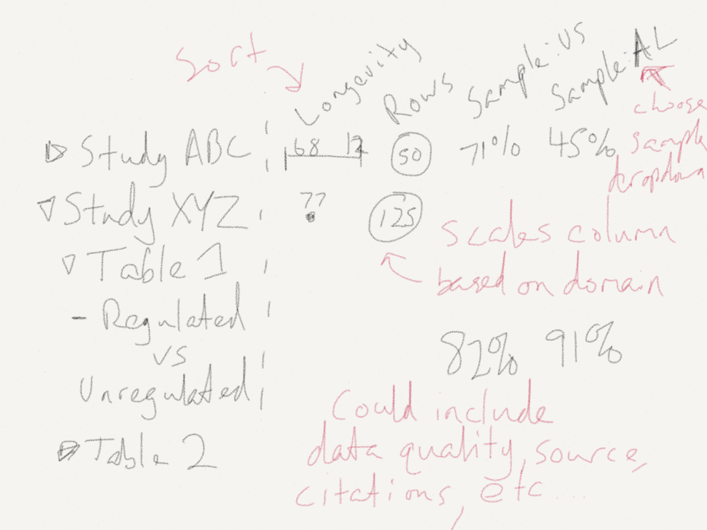

Research-Sparklines
===================

Playing around with the idea of adding sparklines to dataset previews.

# The Idea

I want to be able to see quick previews for metadata about each dataset in a collection. Beyond that, it would be nice to sort based on these atributes.

# Stages

## 0.1
1. Collect metadata from two smaller datasets in the collection
2. Organize simple table view
a. Is this just as simple as a google spreadsheet for now?
b. Build out as a simple webpage to fit with class guidelines.

## 0.2
1. Draw simple bubbles and sparklines 

## Future
* Sort by underlying value
* Change / add sample preview columns

# Open Questions? 
## Would this make more sense as a graph database? 
It seems like, because the structure of the datasets is not uniform it could useful to just describe each one in terms of the connections vs rigid universal commonalities. 
- http://neo4j.com/graphacademy/online-course/

It's going to take some time to understand how to get a simple example of the ground in neo4j. Sticking with simple dummy data for now.