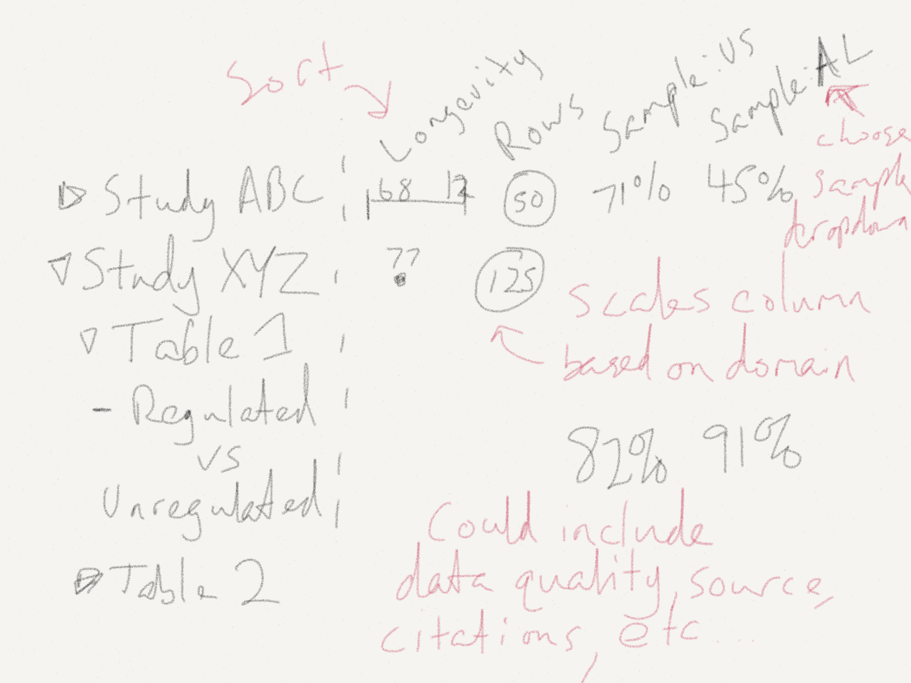
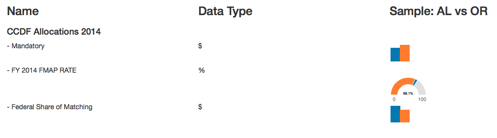

Research-Sparklines
===================

Playing around with the idea of adding sparklines to dataset previews.

# The Idea

I want to be able to see quick previews for metadata about each dataset in a collection. Beyond that, it would be nice to sort based on these atributes.

# Stages

## 0.1
~~1. Collect metadata from two smaller datasets in the collection~~
~~2. Organize simple table view~~

## 0.2
~~1. Draw simple bubbles and sparklines~~

## 0.3
1. Pull data from json to generate the charts.

## Future
* Sort by underlying value (use tristen/tablesort on GitHub)
* Change / add which items are being sampled in the preview columns
* Beautify the layout
* Make this more reusable
* Pre-load data for speed
* Use .filter throughout each chart to limit calling the data over and over

# Open Questions? 
## Would this make more sense as a graph database? 
Because the structure of the datasets is not uniform it could useful to just describe each one in terms of the connections versus rigid, universal commonalities. 
- http://neo4j.com/graphacademy/online-course/

It's going to take some time to understand how to get a simple example of the ground in neo4j. Sticking with simple dummy data for now.

# Inspiration
http://www.highcharts.com/demo/sparkline